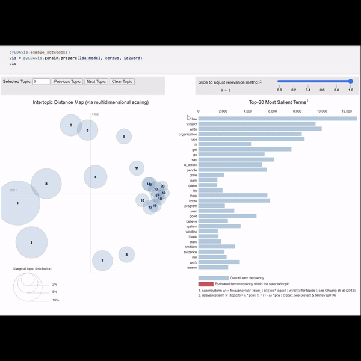

# LDA Topic Modeling

Originally, I was introduced to __Latent Dirichlet Distribution__ for topic modelling in **CS447 Natural Language Processing** course. I am taking the course as part of the **Master's of Data Science** program at the **University of Rochester**. Topic modeling useing LDA was the first assignment of the course. This is an extension of that assignment where I go deeper into experimenting with the gensim LDA model. I also dive into evaluation metrics like **perplexity** and **coherence score** to evaluate the LDA model.

This project is also my introduction to using **BlueHive**, the amazing cloud computing resource, provided by **CIRC** at the UoR. The project wouldn't have been possible without it.

# Acknowledgements
1. My Natural Language Processing course instructor [Hangfeng He](https://hornhehhf.github.io/). He did an amazing job teaching me about LDA.
2. [Topic Modeling with Gensim (Python)](https://www.machinelearningplus.com/nlp/topic-modeling-gensim-python/#17howtofindtheoptimalnumberoftopicsforlda)
3. [Evaluate Topic Models: Latent Dirichlet Allocation (LDA)](https://towardsdatascience.com/evaluate-topic-model-in-python-latent-dirichlet-allocation-lda-7d57484bb5d0)
4. [Intuition Behind Latent Dirichlet Distribution](https://www.youtube.com/watch?v=Cpt97BpI-t4&t=3s)